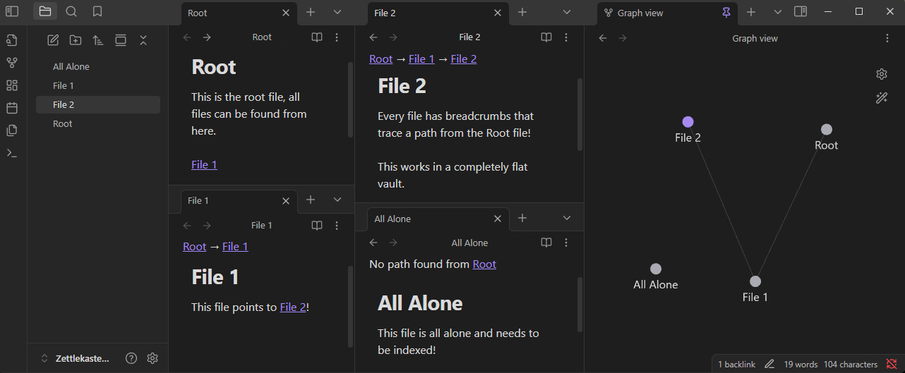

# Backlink Breadcrumbs

Backlink Breadcrumbs is an Obsidian plugin that will add a file trace to the top of each file that traces a path from the Root file.

This is very helpful in flat vault structures.

## Features
- Files all have a trace at the top leading back to the Root file
- The Root file can be specified in the settings
  - Use a full path such as `folder/root.md`
- The plugin will not select the shortest path, but the first path.
  - For example: if a long chain of files is the first chain linked in the Root, that will be the path shown. If you want to prioritize another path, place it higher in the file where the paths branch.

## Contributions
This plugin is open to contributions! Feel free to make issues or pull requests. The goal is to keep this plugin lean.